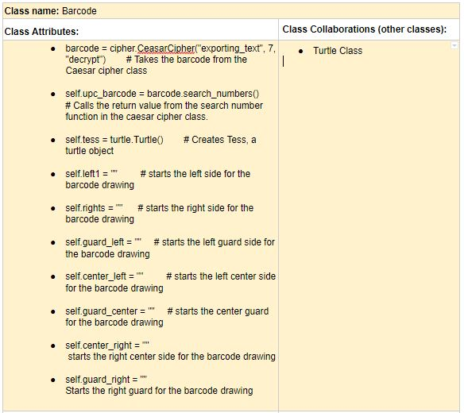
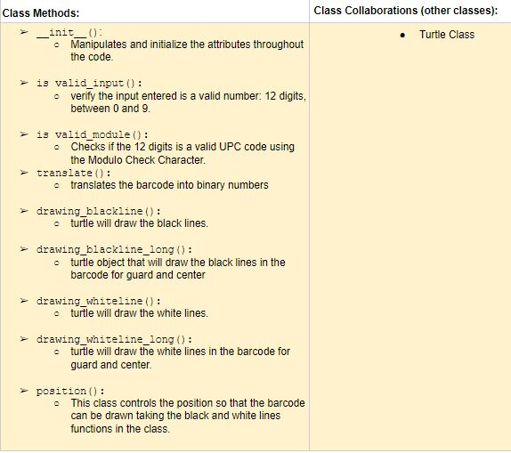

# P01: Secret Barcodes

**Author(s)**: Elaheh Jamali & Emely Alfaro Zavala

**Date**: 11/16/2018

**Document**: https://docs.google.com/document/d/12wtOY-VaoMLb3fmeK7IcRj91hRlnNRL9ehrhWLVdwhY/edit?usp=sharing

## Motivation
We are building this program because we both feel content with our work
with barcodes. That project was challenging and it has been the one we
invested the most time on, therefore we want to make it better by
allowing it to first encrypt and decrypt files, then find the 12-digit codes in
those files and even accessing the web. We both like how encryption
and decryption works and we believe that barcodes are information that
sometimes we might want to have them encrypted because they may refer
to secret and/or illegal items.
## Purpose
Our program will receive a ciphered message with different characters
 and will extract the the 12-digit codes found and check for a barcode,
 afterwards, using the webbrowser library our program will access the web showing the items online.

## Initial Design Plan
- List of all the Classes used in this project:
  - Class Barcode
  - Class CaesarCipher
- List of all the documents that will be used in this project:
   - This is a Website that we will be use to read Barcodes:
   https://www.barcodelookup.com/

#### CRC Cards for the Classes listed above:

**Barcode**:

**CeasarCipher**:

- The main files, which will be calling all of the other code:
  - a08_upc_start.py
  - a09_caesar_cipher.py

## Files
Our final repository will include the following:
- A08_upc_start.py
  - We will use this file as a class. This Class will help us to get
  the barcode number as an input and then using the turtle module we
  can draw the barcode.
 - A09_caesar_cipher.py
   - We will use this file as a Class. The functions will help us to
   encrypt and decrypt files in txt format. Logically, files are
   imported before being decrypted and exported once they are decrypted.
 - final_project.py
   - This file will contain our main function where the other files
    will be imported and used according to the user’s needs.
 - crc_barcode_attributes.jpg  & crc_barcode_methods
   - Contains the CRC card for the Barcode Class.
 - crc_caesar_cipher.jpg
   - Contains the CRC card for the Caesar Cipher class.
 - README.md
    - This file contains information about our design and description of
    each file and classes that we are going to use. This documentation
    will be useful for keeping record and a good reference for the code.
 - encrypting.py
    - This file is to be used by the sender. Once the message is typed, the
    sender can run it and will encrypt the message so that is shared in Google
    drive.
 - messagetext.txt
    - This file will be modifiable because the sender can type different secret
    messages in it.
 - exporting_text
    - This file will be created once the message is decrypted and will be shown in
    pycharm.

## Summary

For our final project, we decided that we wanted to use Caesar Cipher
and barcodes in order to show what it would be like to have two people
send each other encrypted messages with sensitive information.
Our initial plan was vague and we did not know how we would make
It real but we started by creating a coded message that at first looked
Like any random one and we created a Caesar Cipher class that opens the
File and decrypts it for the user. Our next step was to create a barcode
Class and adjust it so that it can retrieve the numbers inside of the decrypted
File even if the numbers were in different formats.

Creating the function to find the numbers in other formats was challenging
at times because we had not learned about dictionaries yet but with
some assistance we were able to get it done.
After getting our program to draw the barcode we revised and discussed whether
we wanted to include the search function but after meeting with
Professor Heggens we decided that we wanted to do it and we even
Used the onclick to get it to work.

## Video

To watch our video please click on the following link:
https://www.youtube.com/watch?v=ZpE_5K4JTHE&feature=youtu.be

## Instructions

Our program is a way for sending secret messages. In order to use it, the sender and receiver
 should have a common Google docs folder in their desktop and the instructions are:

Sender: open the encrypting.py file and run it.
A file will be created in the specific folder that the sender and receiver share.
Receiver: open the final_project.py file and run it.
The program will retrieve the numbers
and show whether the barcode is valid.
Once the barcode drawing shows on screen, you can click on it and you will be taken to the website
where the image of the product is shown.

## Errors

Our program has one limitation. If the sender sends less than 12 digits
in the message the program notifies the user that it is not a valid barcode but
 the turtle screen still runs and nothing gets drawn.

## Reflection

Emely:
Our final project help me realize how much I have learned this semester and how
fun python can be when you know more and when you work on personal projects rather than just
working on homework. I think our program is functional and
rewarding. We combined our ideas and now we have created something to be proud of.
I also had fun when we did the video because I like the idea of
having it online because I think it will be fun to watch it some years from now and
see how much we have improved and learned in our computer science classes.

Elaheh:
Secret Barcodes was a very fun project to make and I learned a lot about classes.
In my opinion CRC cards are the best way to go when you are working with classes
as you can create the cards at the beginning and have an initial idea of what your
class should include. In our case, creating the cards helped us clarify how our program
was supposed to work and we did not end up making major changes to it when we were coding.
As we worked in pairs, it was key to keep good communication and to check on each
other’s work and ideas because we had to make decisions as we advanced on the project.
For me making the video was amusing because I got to use the skills I learned at my
workplace.

Final reflection:
Our project was fun and we both feel more comfortable working with classes and we
 feel satisfied with our final work.

## References

Professor Heggens and professor Lovell:
Both helped us debug and gave us ideas on how our project could be improved.
Professor Heggens gave us the idea of working with a shared file.