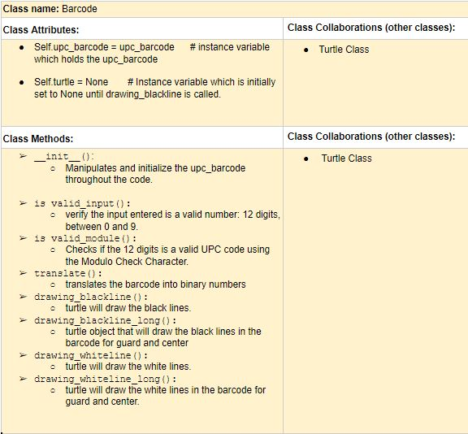

# P01: decrypting barcodes

**Author(s)**: Elaheh Jamali & Emely Alfaro Zavala

**Date**: 11/16/2018

**Document**: https://docs.google.com/document/d/12wtOY-VaoMLb3fmeK7IcRj91hRlnNRL9ehrhWLVdwhY/edit?usp=sharing

## Motivation
We are building this program because we both feel content with our work
in barcodes. That project was challenging and it has been the one we
invested the most time on, therefore we want to make it better by
allowing it to first decrypt files, then find the 12-digit codes in
those files and even accessing the web. We both like how encryption
and decryption works and we believe that barcodes are information that
sometimes we might want to have them encrypted because they may refer
to secret and/or illegal items.
## Purpose
Our program will receive a ciphered message with different characters
 and will extract the the 12-digit codes found and check for a barcode,
 afterwards, using the urllib our program will access the web showing the item online.

## Initial Design Plan
- List of all the Classes used in this project:
  - Class Barcode
  - Class CaesarCipher
- List of all the documents that will be used in this project:
   - This is a Website that we will be use to read Barcodes:
   https://www.barcodelookup.com/

#### CRC Cards for the Classes listed above:

**Barcode**:

**CeasarCipher**:

- The main files, which will be calling all of the other code:
  - a08_upc_start.py
  - a09_caesar_cipher.py

**NOTE 1**: Your initial design plan may not fully reflect your final product,
as projects evolve over time.

**NOTE 2**: Do not skip the CRC card part of Milestone 1! We will be providing
immediate feedback which will be helpful in succeeding in the rest of the project.

## Files
Our final repository will include the following:
- A08_upc_start.py
  - We will use this file as a class. This Class will help us to get
  the barcode number as an input and then using the turtle module we
  can draw the barcode.
 - A09_caesar_cipher.py
   - We will use this file as a Class. The functions will help us to
   encrypt and decrypt files in txt format. Logically, files are
   imported before being decrypted and exported once they are decrypted.
 - final_project.py
   - This file will contain our main function where the other files
    will be imported and used according to the user’s needs.
 - Test_suite_final_project.py
   - In order to make sure our code works properly, we have created a
   test suite file that will test all fruitful functions.
 - crc_barcode.jpg
   - Contains the CRC card for the Barcode Class.
 - crc_ceasarcipher.jpg
   - Contains the CRC card for the Caesar Cipher class.
 - README.md
    - This file contains information about our design and description of
    each file and classes that we are going to use. This documentation
    will be useful for keeping record and a good reference for the code.

## Summary
*You'll complete this part at the end of the project.*

Provide a brief summary description of the design and implementation,
including how much your initial design plan evolved, the final result
you achieved and the amount of time you spent as a programmer in
accomplishing these results, including any challenges overcome and
innovations that were not specifically required by the assignment.
This section should be no more than three paragraphs.

## Video
*You'll complete this part at the end of the project.*

In this section, add a publicly available link to a YouTube video
which you will create, demonstrating how to use your program.
The video is a short (less than 5 minutes) demonstration video.
Your video should include:
- A title screen, including the class name, your name, and the project title
- You briefly discussing your project and it's motivation
- A demonstration on how to use the program, much like a marketing video.
- A short discussion about what you learned through the process of building the program.
- DO NOT include a section where you scroll through the code. Your video should include NO code.
- A credits roll

## Instructions
Explain how to use your program and/or play your game.

## Errors
*You'll complete this part at the end of the project.*

Every program has bugs. Use this section to create a bullet list of
all known errors and deficiencies that remain in your code.

## Reflection
*You'll complete this part at the end of the project.*

Write 2 - 4 paragraphs on your reactions to the final project.

## References
Throughout this project, you've likely used outside resources.
Reference all ideas or code which are not your own, and describe and
how you integrated the ideas or code into your program. This includes
online sources, people who have helped you, and any other resources that
are not solely your own contribution.

---
**A Note From Emily and Scott to You**

While there may seem like a lot of work to this final project, one
thing to keep in mind is HAVE FUN with it! Create code to
express your personal interests. Make a fun video, not a boring walkthrough.
Break up the writing so it’s not so burdensome.
We will have a live demo session on our last day of class.
It'll be the most fun final exam you've ever had!
